# 02 — Luồng

Mã màn: `01_MAN_HINH.md`.  
Session mock **không persist**, **không sync** User ↔ Coach.

## Lưu ý chung

- Dev (`ENV=development`): mọi màn User/Coach bọc U03 — AppBar nút `Chuyển sang Coach` / `Chuyển sang User`.
- Prod: Splash → (nếu chưa consent) U02 → flavor User U04 hoặc flavor Coach C01. Không ModeSwitcher.

---

## U-L1 Đăng nhập OTP giả lập → hồ sơ → Bản đồ

U01 Splash → (prod) U02 → U04 `Xác thực số điện thoại` → `Gửi mã OTP` → `Nhập mã xác thực` (mọi 6 số; SnackBar `Mã demo: 123456`) → U05 `Tạo hồ sơ` (tên bắt buộc) `Tiếp tục` → U06 tab Bản đồ = U07.

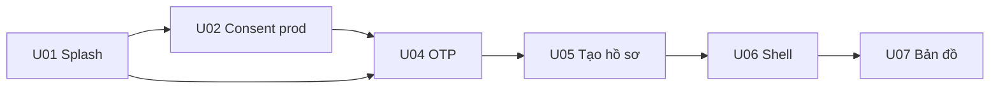

## U-L2 Bản đồ: lọc Coach / Phòng gym → Chỉ đường

U07 chip `Coach` | `Phòng gym`. Coach: tap marker/card → U09. Gym: tap marker → sheet U07a; `Chỉ đường` → Google Maps ngoài (fail: `Không mở được Google Maps.`).

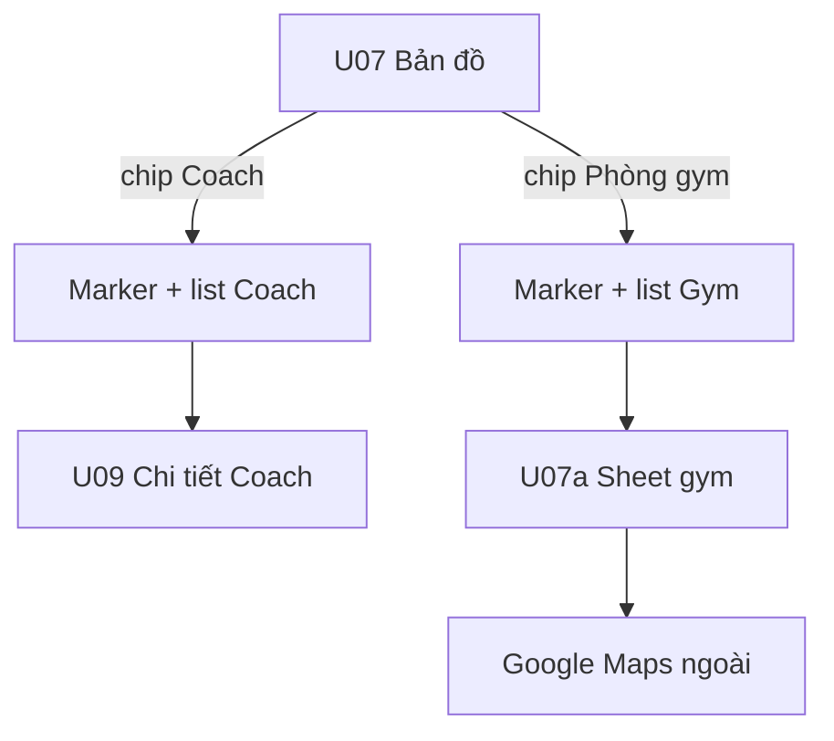

## U-L3 Xem Coach → dịch vụ/gói → xác nhận đặt lịch → theo dõi → xác nhận + đánh giá → nhật ký

U09 chọn radio dịch vụ → `Chọn HLV` → U10. (Tuỳ chọn: tab `Gói` → `Mua` → dialog `Xác nhận mua`.)  
U10 `Đặt lịch ngay` → U11 auto-advance 3s: pending → confirmed → inProgress → awaitingUserConfirmation.  
Sao + `Xác nhận đã nhận dịch vụ` → completed. `📸 Chia sẻ buổi tập hôm nay` → U17 (ảnh bắt buộc) `Đăng` → U14.

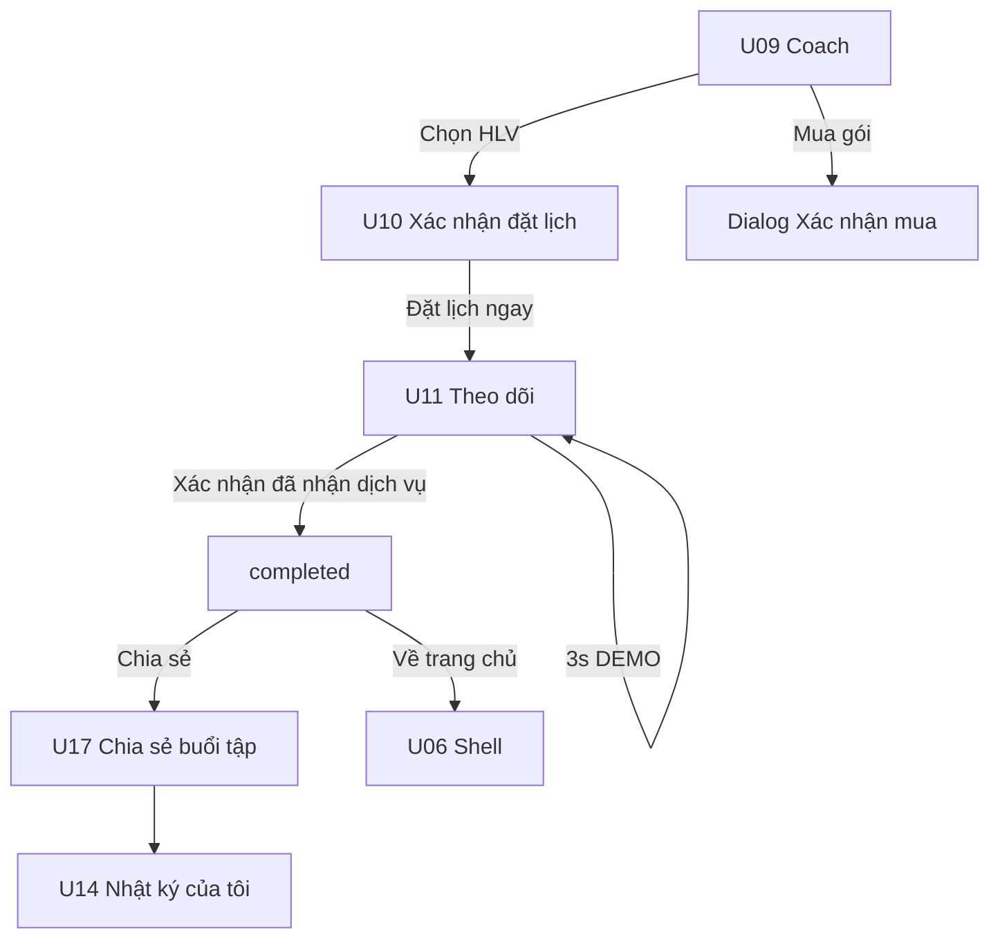

## U-L4 Mua gói của Coach

U09 tab `Gói` → `Mua` → `Xác nhận mua` / `Hủy`. Sau mua: khối `Gói đã mua` `{remainingLabel}`. Dùng lúc U10 nếu `remainingSessions > 0` đúng `coachId`.

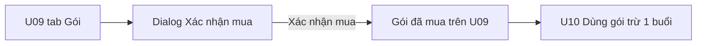

## U-L5 Chat trước booking và trong booking

Trước: U10 `Trao đổi với Coach` → U12 inquiry (subtitle `Trao đổi trước khi đặt lịch`).  
Trong: U11 từ mốc confirmed (và inquiry) `Chat với Coach` → U12 theo `bookingId`.  
**Không** hiện tin nhắn bên C04.

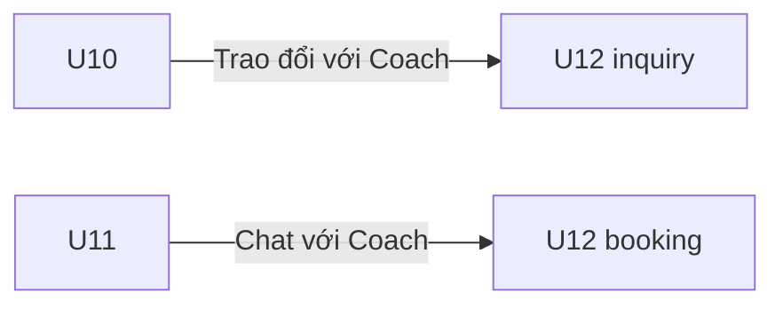

## U-L6 Lịch sử booking

U06 tab `Lịch sử` = U13. Tap: trackable → U11 live; completed/cancelled → U11 `readOnly: true` title `Chi tiết Booking`.

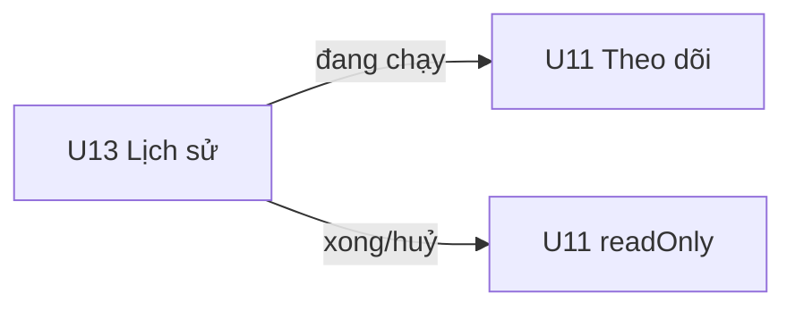

## U-L7 Nhật ký / Cộng đồng / chi tiết / like / bình luận / báo cáo

U14 / U15 grid → U16. `Thả tim` / `Đã thích`; composer `Viết bình luận...`; AppBar `Báo cáo` → SnackBar `Đã ghi nhận báo cáo` (không ẩn bài).

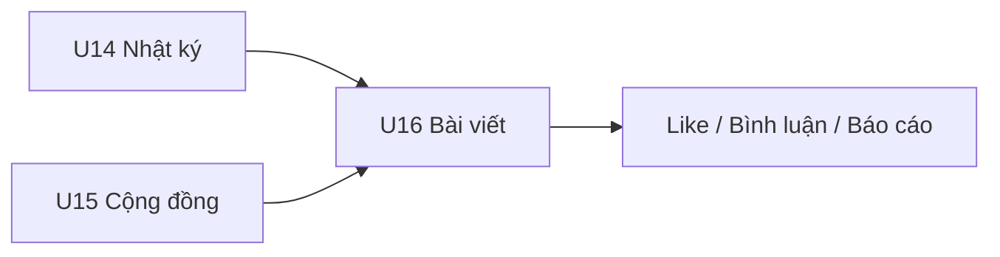

## U-L8 Kết quả học viên

U09 `Kết quả học viên` → `Xem chi tiết` → U18 (Trước/Sau + `Tóm tắt` + `Nhật ký tiến độ`).

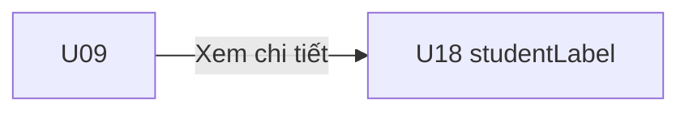

## U-L9 PT AI

U06 FAB `PT AI` → U19 `Bắt đầu` → U20 chọn bài `Bắt đầu tập` → U21 timer/cue → nghỉ 5s → bài sau → U22 `Xong` → U06. U21 `Dừng` → dialog `Dừng buổi tập?`.

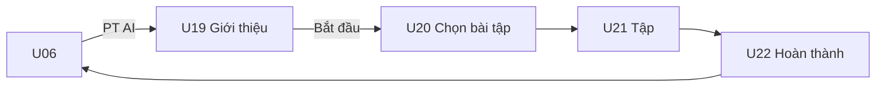

---

## C-L1 Home: rảnh + vị trí

C01 Switch `Đang rảnh`; `Cập nhật vị trí` cycle Quận 2 → 1 → 7 → Thủ Đức.

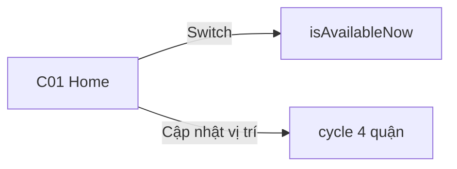

## C-L2 Nhận booking → xác nhận / từ chối

C01 card `Booking mới cần xác nhận` → C03. `Xác nhận` → confirmed. `Từ chối` → cancelled lý do `Coach từ chối`.

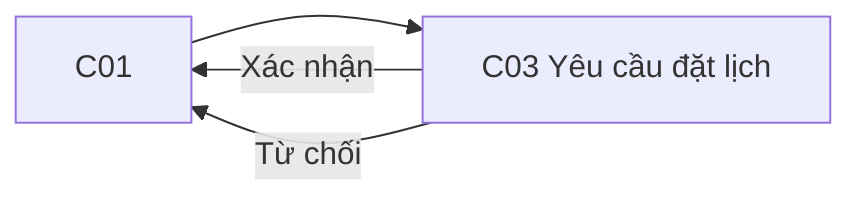

## C-L3 Booking đang chạy → bắt đầu → hoàn thành / không đến

C01 `Booking đang diễn ra` → C02. confirmed: `Bắt đầu buổi tập` / `Báo cáo khách không đến`. inProgress: `Hoàn thành dịch vụ` → awaitingUserConfirmation (chờ User U11). Coach **không** tự `completed`.

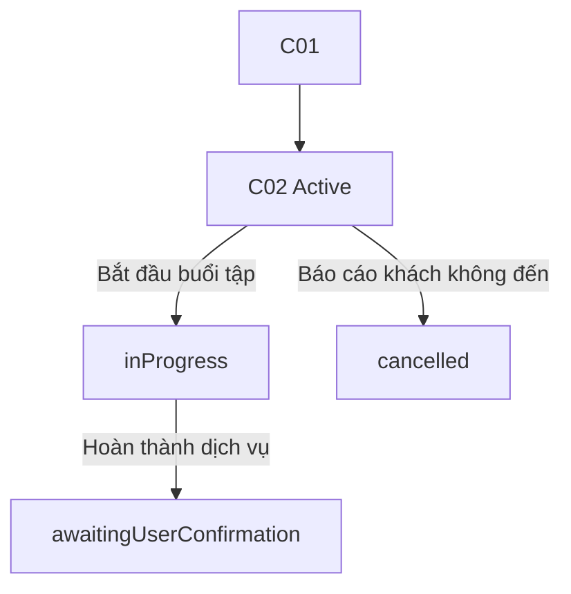

## C-L4 Chat Coach

C02 `Vào Chat` → C04. Gửi `Nhắn tin cho khách...`. Không sync U12.

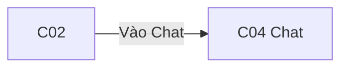

## C-L5 Dịch vụ / Gói

C01 icon tạ → C05. Tab Dịch vụ / Gói; menu `Sửa`/`Xóa`; FAB `+`. Không xoá dịch vụ cuối.

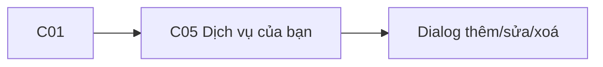

## C-L6 Chỉnh sửa hồ sơ

C01 `Chỉnh sửa hồ sơ` → C06 `Lưu` → pop + `Đã lưu hồ sơ trong phiên demo.` Không sync catalog User U09.

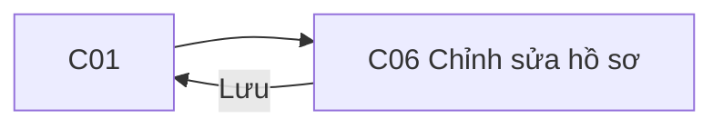

## C-L7 Nhật ký học viên

C01 `Nhật ký học viên` → C07 grid → U16 `readOnly: true` (không like/comment/báo cáo). Seed độc lập (`cjp_01`, `cjp_02`).

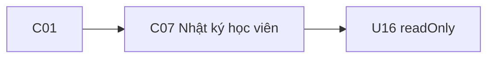

---

## X-L1 Chuyển User ↔ Coach (dev)

U03 AppBar: User → `Chuyển sang Coach` (icon `Icons.person`) · Coach → `Chuyển sang User` (`Icons.engineering`). Body đổi `_UserPilotGate` ↔ `CoachHomeScreen`. Session mock **không** copy qua.

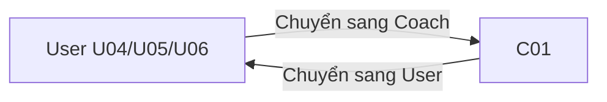
